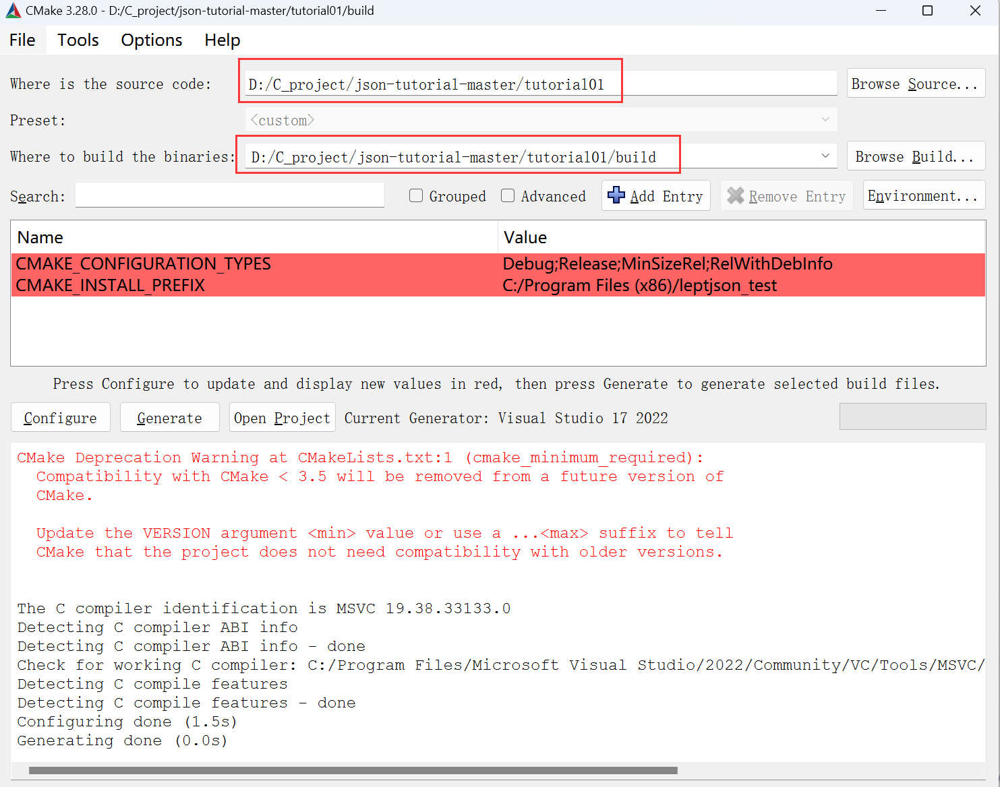

##### C_Project——JSON库

###### 1 JSON是什么？

JSON（JavaScript Object Notation）是一种**轻量级的数据交换格式**，常用于**前后端**之间的数据传输和存储。它采用键值对的方式来组织数据，具有易于理解和编写的特点。

JSON数据结构简单，由对象（Object）、数组（Array）、字符串（String）、数字（Number）、布尔值（Boolean）和null等基本数据类型组成。它支持嵌套和层级关系，可以表示复杂的数据结构。

* null: 表示为 null
* boolean: 表示为 true 或 false
* number: 一般的浮点数表示方式，在下一单元详细说明
* string: 表示为 "..."
* array: 表示为 [ ... ]
* object: 表示为 { ... }

在JSON中，数据以键值对的形式表示，键和值之间使用冒号分隔，不同的键值对之间使用逗号分隔。键必须是字符串，值可以是任意合法的JSON数据类型。

例如，以下是一个简单的JSON对象的示例：

```
{
    "title": "Design Patterns",	//string
    "subtitle": "Elements of Reusable Object-Oriented Software",	//string
    "author": [
        "Erich Gamma",
        "Richard Helm",
        "Ralph Johnson",
        "John Vlissides"
    ],	//array
    "year": 2009,	//number
    "weight": 1.8,	//number
    "hardcover": true,	//boolean
    "publisher": {
        "Company": "Pearson Education",
        "Country": "India"
    },	//object
    "website": null	//boolean
}
```

JSON数据具有跨平台、易于解析和生成的特点，被广泛应用于Web开发、移动应用程序和API接口等领域。

---

###### 2 JSON库是什么？

JSON库是用于解析和生成JSON（JavaScript Object Notation）格式的数据的工具库。

**它提供了一组函数和方法，可以将JSON数据转换为编程语言中的对象或数据结构，以及将对象或数据结构转换为JSON格式的字符串。**

JSON库可以帮助开发者在编程语言中方便地处理JSON数据，实现解析、读取、修改和生成JSON数据的功能。

**通过JSON库，开发者可以将从服务器接收到的JSON数据解析成对应的数据结构，方便对数据进行处理和操作。同时，也可以将程序中的数据转换为JSON格式的字符串，然后发送给服务器或其他应用程序。**JSON库还能够处理特殊情况，如日期和时间的格式化、Unicode字符的处理等。

---

###### 3 实现的功能


1. 把 JSON 文本解析为一个树状数据结构（parse）。
2. 提供接口访问该数据结构（access）。
3. 把数据结构转换成 JSON 文本（stringify）。

>在第一单元中，主要实现最简单的null和boolean解析
>
>* null: 表示为 null
>* boolean: 表示为 true 或 false

---

###### 4 文件结构

老师的 JSON 库名为 leptjson，代码文件只有 3 个：

1. `leptjson.h`：leptjson 的头文件（header file），含有对外的类型和 API 函数声明。
2. `leptjson.c`：leptjson 的实现文件（implementation file），含有内部的类型声明和函数实现。此文件会编译成库。
3. `test.c`：我们使用测试驱动开发（test driven development, TDD）。此文件包含测试程序，需要链接 leptjson 库。

---

###### 5 编译环境安装和使用

在在 Windows 下，下载安装 CMake 后，可以使用其 cmake-gui 程序：



>在其中，尤其注意需要下载visual studio 2022或者其他版本作为编译器，否则会报错

按 Configure，选择编译器，然后按 Generate 便会生成 Visual Studio 的 .sln 和 .vcproj 等文件。

注意这个 build 目录都是生成的文件，可以随时删除，也不用上传至仓库。

---

###### 6 JSON语法子集

下面是此单元的 JSON 语法子集，使用 [RFC7159](https://tools.ietf.org/html/rfc7159) 中的 [ABNF](https://tools.ietf.org/html/rfc5234) 表示：

~~~
JSON-text = ws value ws
ws = *(%x20 / %x09 / %x0A / %x0D)
value = null / false / true 
null  = "null"
false = "false"
true  = "true"
~~~

当中 `%xhh` 表示以 16 进制表示的字符，`/` 是多选一，`*` 是零或多个，`()` 用于分组。

第一行：**JSON 文本**由 3 部分组成，首先是空白（whitespace），接着是一个值，最后是空白。

第二行：**JSON空白**，是由零或多个空格符（space U+0020）、制表符（tab U+0009）、换行符（LF U+000A）、回车符（CR U+000D）所组成。

第三行：现时的值只可以是 null、false 或 true，它们分别有对应的字面值（literal）。

我们的解析器应能判断输入是否一个合法的 JSON。如果输入的 JSON 不合符这个语法，我们要产生对应的错误码，方便使用者追查问题。

在这个 JSON 语法子集下，我们定义 3 种错误码：

* 若一个 JSON 只含有空白，传回 `LEPT_PARSE_EXPECT_VALUE`。
* 若一个值之后，在空白之后还有其他字符，传回 `LEPT_PARSE_ROOT_NOT_SINGULAR`。
* 若值不是那三种字面值，传回 `LEPT_PARSE_INVALID_VALUE`。

---

###### 7 单元测试

单元测试在test.c文件中

```c++
#include <stdio.h>
#include <stdlib.h>
#include <string.h>
#include "zyhjson.h"

//设置静态变量
static int main_ret = 0;
static int test_count = 0; 
static int test_pass = 0; 

#define EXPECT_EQ_BASE(equality, expect, actual, format) \
    do {\
        test_count++;\
        if (equality)\
            test_pass++;\
        else {\
            fprintf(stderr, "%s:%d: expect: " format " actual: " format "\n", __FILE__, __LINE__, expect, actual);\
            main_ret = 1;\
        }\
    } while(0)

#define EXPECT_EQ_INT(expect, actual) EXPECT_EQ_BASE((expect) == (actual), expect, actual, "%d")

static void test_parse_null() {
    zyh_value v; //定义树节点y
    v.type = ZYH_TRUE; //v类型为true类型
    EXPECT_EQ_INT(ZYH_PARSE_OK, zyh_parse(&v, "null")); //调用解析函数，其中json字符串为null，判断是否解析成功
    EXPECT_EQ_INT(ZYH_NULL, zyh_get_type(&v));     //调用获取类型函数，判断获取的类型是否是ZYH_NULL类型
}

/* ... */

static void test_parse() {
    test_parse_null(); //调用parse中测试null的函数
    /* ... */
}

int main() {
    test_parse();   //调用parse测试函数
    printf("%d/%d (%3.2f%%) passed\n", test_pass, test_count, test_pass * 100.0 / test_count);//打印静态变量，通过数量，计数以及分数
    return main_ret;
}
```

###### 8 cpp文件中主要函数作用以及结构

```c++
/*
	作用：解析json字符串函数
	参数：
		-zyh_value* v:指向zyh_value结构体的指针，作为解析json后保存的树节点
		-const char* json: const指向json的字符串
	返回值：
		int: 返回的为枚举类型
    		ZYH_PARSE_OK = 0,   //解析成功
   			ZYH_PARSE_EXPECT_VALUE,     //超出，只有空白
    		ZYH_PARSE_INVALID_VALUE,    //无效值，解析不是三种字面值 null/ false/ true
    		ZYH_PARSE_ROOT_NOT_SINGULAR //不唯一,一个值后，空白之后还有其他字符
*/
int zyh_parse(zyh_value* v, const char* json)
    
/*
	作用：获取解析后的类型
	参数：
		-const zyh_value*v：指向zyh_value结构体的指针，作为解析json后保存的树节点
	返回值：
		zyh_type：分为 ZYH_NULL, ZYH_FALSE, ZYH_TRUE, ZYH_NUMBER, ZYH_STRING, ZYH_ARRAY, ZYH_OBJECT这几种类型
*/
zyh_type zyh_get_type(const zyh_value* v)
```

`zyh_parse`首先调用`zyh_parse_whitespace(&c)`跳过空格后，再调用

`static int zyh_parse_value(zyh_context* c, zyh_value* v) `


###### 9 解析关键点

由于 JSON 语法特别简单，我们不需要写分词器（tokenizer），只需检测下一个字符，便可以知道它是哪种类型的值，然后调用相关的分析函数。对于完整的 JSON 语法，跳过空白后，只需检测当前字符：

* n ➔ null
* t ➔ true
* f ➔ false
* " ➔ string
* 0-9/- ➔ number
* [ ➔ array
* { ➔ object


###### 10 assert

断言（assertion）是 C 语言中常用的防御式编程方式，减少编程错误。最常用的是在函数开始的地方，检测所有参数。有时候也可以在调用函数后，检查上下文是否正确。

C 语言的标准库含有 [`assert()`](https://en.cppreference.com/w/c/error/assert) 这个宏（需 `#include <assert.h>`），提供断言功能。当程序以 release 配置编译时（定义了 `NDEBUG` 宏），`assert()` 不会做检测；而当在 debug 配置时（没定义 `NDEBUG` 宏），则会在运行时检测 `assert(cond)` 中的条件是否为真（非 0），断言失败会直接令程序崩溃。

`assert(条件)` 其中条件为true才继续执行，否则报错


##### 报错问题

在test.c中出现无法解析函数 test_parse_expect_value中的zyh_parse函数和zyh_get_type函数

```c++
D:\C_project\zyhjson\out\build\x64-debug\zyhjson\test.c.obj : error LNK2019: 无法解析的外部符号 zyh_parse，函数 test_parse_expect_value 中引用了该符号
    已定义且可能匹配的符号上的提示:
      "int __cdecl zyh_parse(struct zyh_value *,char const *)" (?zyh_parse@@YAHPEAUzyh_value@@PEBD@Z)
D:\C_project\zyhjson\out\build\x64-debug\zyhjson\test.c.obj : error LNK2019: 无法解析的外部符号 zyh_get_type，函数 test_parse_expect_value 中引用了该符号
    已定义且可能匹配的符号上的提示:
      "enum zyh_type __cdecl zyh_get_type(struct zyh_value const *)" (?zyh_get_type@@YA?AW4zyh_type@@PEBUzyh_value@@@Z)
```

处理办法：`在test.c文件中加入zyhjson.c文件`

---

