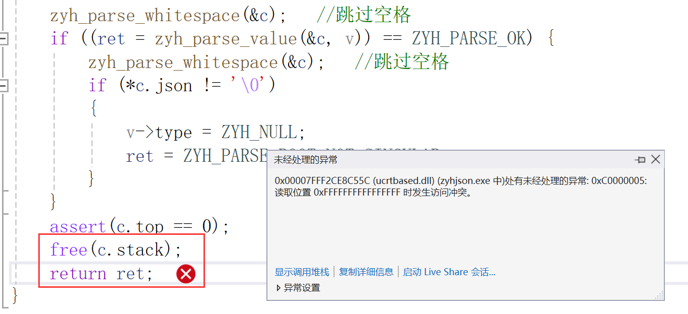

### tutorial03

>tutorial实现解析字符串

##### 1 转义

JSON支持9种转义序列：

```json
string = quotation-mark *char quotation-mark
char = unescaped /
   escape (
       %x22 /          ; "    quotation mark  U+0022
       %x5C /          ; \    reverse solidus U+005C
       %x2F /          ; /    solidus         U+002F
       %x62 /          ; b    backspace       U+0008
       %x66 /          ; f    form feed       U+000C
       %x6E /          ; n    line feed       U+000A
       %x72 /          ; r    carriage return U+000D
       %x74 /          ; t    tab             U+0009
       %x75 4HEXDIG )  ; uXXXX                U+XXXX
escape = %x5C          ; \
quotation-mark = %x22  ; "
unescaped = %x20-21 / %x23-5B / %x5D-10FFFF
```

转义序列有9种，以反斜线开始，如常见的`\n`换行符。`\uXXXX`不在此单元处理

无转义字符就是普通的字符，语法中列出了合法的码点范围（码点还是在下单元才介绍）。要注意的是，该范围不包括 0 至 31、双引号和反斜线，这些码点都必须要使用转义方式表示。

>Unicode 码点是指每个字符在 Unicode 标准中所对应的唯一数字标识。这些码点通常用十六进制表示，并加上前缀 "U+"。例如，拉丁字母 A 的 Unicode 码点是 U+0041，而中文汉字"中"的 Unicode 码点是 U+4E2D。Unicode 码点为每个字符提供了一个唯一的标识，使得不同的计算机系统和软件能够准确地识别和处理各种语言的文字。
>
>Unicode码点0~31字符：
>
>Unicode 码点从 0 到 31 代表了一些控制字符，通常被称为 C0 控制字符。这些字符并不直接用于表示可打印的文字或图形，而是用于控制文本的格式、布局和传输等方面。以下是从 0 到 31 的一些常见的 C0 控制字符及其对应的描述：
>
>- U+0000: NUL (空字符) - 通常用于字符串的结尾或空白填充。
>- U+0001: SOH (开始标题) - 在传统的电报通信中用于指示文本开始。
>- U+0002: STX (正文开始) - 在传统的电报通信中用于指示正文开始。
>- U+0003: ETX (正文结束) - 在传统的电报通信中用于指示正文结束。
>- U+0004: EOT (结束传输) - 在传统的电报通信中用于指示文本传输结束。
>- U+0005: ENQ (询问) - 在传统的电报通信中用于请求一个回应。
>- U+0006: ACK (确认) - 在传统的电报通信中用于确认接收到的信息。
>- U+0007: BEL (响铃) - 产生一声响铃的音频或者触发其他的提示效果。
>- U+0008: BS (退格) - 将光标回退一个位置。
>- U+0009: HT (水平制表符) - 用于在文本中进行水平制表对齐。
>- U+000A: LF (换行) - 在文本中表示换行。
>- U+000B: VT (垂直制表符) - 在文本中进行垂直制表对齐。
>- U+000C: FF (换页) - 在文本中进行分页。
>- U+000D: CR (回车) - 在文本中表示回车。
>- U+000E: SO (Shift Out) - 在传统的电报通信中用于切换到另一字符集。
>- U+000F: SI (Shift In) - 在传统的电报通信中用于切换回原始字符集。
>
>这些控制字符在实际文本中很少直接使用，而是在计算机和通信系统中用于控制和处理文本数据。


##### 2 字符串表示

分配内存来存储解析后的字符，因此在`zyh_value`中加入`char* s`，以及记录长度`size_t len`

 ```c++
 typedef struct {
     char* s;
     size_t len;
     double n;
 	zyh_type type;  //枚举变量 type
 }zyh_value;
 ```

使用union结构体来节省内存，允许你在相同的内存位置存储不同的数据类型。它类似于结构体（`struct`），但**只能同时存储其中的一个成员**。

```c++
typedef struct {
    union {
        struct { char* s; size_t len; }s;  /* string */
        double n;                          /* number */
    }u;
	zyh_type type;  //枚举变量 type
}zyh_value;
```


##### 3 内存管理

使用动态内存分配的方式来分配内存，创建 `zyh_set_string` 函数来动态分配内存

```c++
void zyh_set_string(zyh_value* v, const char* s, size_t len)
{
	assert(v != NULL && (s != NULL || len == 0));
	zyh_free(v);	//释放之前分配为string类型的内存
	v->u.str.s = (char*)malloc(len + 1);
	memcpy(v->u.str.s, s, len);
	v->u.str.s[len] = '\0';
	v->u.str.len = len;
	v->type = ZYH_STRING;
}
```


##### 4 缓冲区

解析字符串时，需要先将解析的结果存放在一个临时的缓冲区内，最后再使用 `zyh_set_string()`将缓冲区结果存放进值中。需要使用动态数组的方式，就是数组空间不够时，能够自动扩展

而且我们将会发现，无论是解析字符串、数组或对象，我们也只需要以先进后出的方式访问这个动态数组。换句话说，我们需要一个动态的堆栈（stack）数据结构。

因此在`zyh_context`中增加数据

```c++
typedef struct {
	const char* json;
	char* stack;
	size_t size;
	size_t top;
}zyh_context;
```

当中 `size` 是当前的堆栈容量，`top` 是栈顶的位置（由于我们会扩展 `stack`，所以不要把 `top` 用指针形式存储）。

```c++
#ifndef ZYH_PARSE_STACK_INIT_SIZE
#define ZYH_PARSE_STACK_INIT_SIZE 256
#endif

/*void* 可以指向任意类型的数据。*/
static void* zyh_context_push(zyh_context* c, size_t size)
{
	void* ret;
	assert(size > 0);
	if (c->top + size >= c->size) {
		if (c->size == 0)
			c->size = ZYH_PARSE_STACK_INIT_SIZE;
		while (c->top + size >= c->size)
			c->size += c->size >> 1;  /* c->size * 1.5 */
		c->stack = (char*)realloc(c->stack, c->size);
	}
	ret = c->stack + c->top;
	c->top += size;
	return ret;
}

static void* zyh_context_pop(zyh_context* c, size_t size) {
	assert(c->top >= size);
	return c->stack + (c->top -= size);
}
```


##### 5 解析字符串

我们只需要先备份栈顶，然后把解析到的字符压栈，最后计算出长度并一次性把所有字符弹出，再设置至值里便可以。以下是部分实现，没有处理转义和一些不合法字符的校验。

```c++
#define PUTC(c, ch) do { *(char*)lept_context_push(c, sizeof(char)) = (ch); } while(0)

static int lept_parse_string(lept_context* c, lept_value* v) {
    size_t head = c->top, len;	//head保存了当前lept_context的栈顶位置
    const char* p;
    EXPECT(c, '\"');//检查当前是否为双引号字符，如果不是则返回错误。
    p = c->json;
    for (;;) {	//这是一个无限循环，表示将持续解析字符串直到遇到结束条件。
        char ch = *p++;	
        switch (ch) {
            //如果字符是双引号，则表示字符串解析结束，根据解析结果设置 lept_value 的值，并返回解析成功。
            case '\"':
                len = c->top - head;
                lept_set_string(v, (const char*)lept_context_pop(c, len), len);
                c->json = p;
                return LEPT_PARSE_OK;
            //如果字符是空字符，则表示字符串没有以双引号结尾，返回缺少引号的错误。
            case '\0':
                c->top = head;
                return LEPT_PARSE_MISS_QUOTATION_MARK;
            default:
                PUTC(c, ch);
        }
    }
}
```


##### 6 总结与练习

之前的单元都是固定长度的数据类型（fixed length data type），而字符串类型是可变长度的数据类型（variable length data type），因此本单元花了较多篇幅讲述内存管理和数据结构的设计和实现。字符串的解析相对数字简单，以下的习题难度不高，同学们应该可轻松完成。

1. 编写 `lept_get_boolean()` 等访问函数的单元测试，然后实现。
2. 实现除了 `\u` 以外的转义序列解析，令 `test_parse_string()` 中所有测试通过。
3. 解决 `test_parse_invalid_string_escape()` 和 `test_parse_invalid_string_char()` 中的失败测试。
4. 思考如何优化 `test_parse_string()` 的性能，那些优化方法有没有缺点。

参考：[RapidJSON 代码剖析（一）：混合任意类型的堆栈 - 知乎 (zhihu.com)](https://zhuanlan.zhihu.com/p/20029820)

---

##### 7 错误

在运行test.c出现报错信息：

出错位置：

```c++
int zyh_parse(zyh_value* v, const char* json)
{
	int ret;
	zyh_context c;
	/*
	*	v!=null为真继续执行
	*	v不为空继续执行，若为空则报错
	*/
	assert(v != NULL); 
	c.json = json;		
	v->type = ZYH_NULL;	//先写入为ZYH_NULL类型
	c.size = c.top = 0;
	zyh_init(v);

	zyh_parse_whitespace(&c);	//跳过空格
	if ((ret = zyh_parse_value(&c, v)) == ZYH_PARSE_OK) {
		zyh_parse_whitespace(&c);	//跳过空格
		if (*c.json != '\0')
		{
			v->type = ZYH_NULL;
			ret = ZYH_PARSE_ROOT_NOT_SINGULAR;
		}
	}
	assert(c.top == 0);
	free(c.stack);
	return ret;
}
```



出错信息：

> 0x00007FFF0B32C55C (ucrtbased.dll) (zyhjson.exe 中)处有未经处理的异常: 0xC0000005: 读取位置 0xFFFFFFFFFFFFFFFF 时发生访问冲突。

解决方法：

增加一个新的函数`void free_c_stack(zyh_context* c)`用于释放zyh_context结构体中的stack分配的空间，并且设置指向的空间为NULL，避免野指针。

函数如下：

```c++
void free_c_stack(zyh_context* c)
{
	if (c->stack != NULL)
	{
		free(c->stack);
	}
	c->stack = NULL;
}
```

在解决完这个错误后，会出现realloc分配的错误，原因在于 `zyh_context`中的`stack`未初始化，因此在`static void* zyh_context_push(zyh_context* c, size_t size)`中增加`stack`的初始化

>因为realloc函数`void *realloc(void *mem_address, unsigned int newsize);`
>
>**传递给realloc的指针必须是先前通过malloc(), calloc(), 或realloc()分配的,或者是NULL**

```c++
static void* zyh_context_push(zyh_context* c, size_t size)
{
	void* ret;
	assert(size > 0);	//断言,size>0继续执行，否则中断
	if (c->top + size >= c->size) {
		if (c->size == 0)
		{
			c->stack = NULL;		//设置栈大小为NULL
			c->size = ZYH_PARSE_STACK_INIT_SIZE;	/*初始化栈大小*/
		}
		while (c->top + size >= c->size)
			c->size += c->size >> 1;  /* c->size * 1.5 */
		//c->stack = (char*)realloc(c->stack, c->size);
		void* new_stack = realloc(c->stack, c->size);
		if (new_stack == NULL) {
			// 处理内存分配失败的情况
			// 可以选择返回错误码或采取其他适当的处理方式
			// 这里简单地打印错误消息并返回 NULL
			printf("Memory allocation failed\n");
			return NULL;
		}
		c->stack = (char*)new_stack;
	}
	ret = c->stack + c->top;
	c->top += size;
	return ret;
}
```


##### 8 杂项

- `size_t`：size_t是一种无符号整数类型，具体取决于平台和编译器，通常被定义为足够大以容纳系统中最大可能的对象大小。在C/C++中使用size_t可以提高代码的可移植性和兼容性，因为它在不同平台上是一致的。

- `void*`：`void*`是一种通用指针类型，被称为"无类型指针"。它可以指向任何数据类型的对象，因为它不具体指定指针所指向的数据类型。这样设计的目的是为了增加函数的通用性，使其能够处理各种数据类型的对象。

- `realloc`：函数用于重新分配内存块大小
  - 参数1 指向已分配内存块的指针：通常是使用`malloc`、`calloc`或`realloc`分配内存后返回的指针。
  - 参数2 新的内存块大小：用于指定重新分配后的内存块大小。

```c++
void* new_stack = realloc(c->stack, c->size);
c->stack = (char*)new_stack;
```

这段代码将重新分配 `c->stack` 指向的内存块的大小为 `c->size`，并将重新分配后的指针赋值给 `c->stack`。由于 `realloc` 可能会返回一个新的指针，因此需要将其转换为适当的类型（在这里是 `char*`）。


###### realloc

```c
void *realloc(void *mem_address, unsigned int newsize);
```

判断当前指针是否有足够的连续空间，如果有，扩大mem_address指向的地址，并且将mem_address返回；如果空间不够，先按照newsize指定的大小分配空间，将原有数据从头到尾拷贝到新分配的内存区域，释放原来的mem_address内存区域，同时返回新分配的内存区域的首地址。

如果重新分配成功则返回指向被分配内存的[指针](https://baike.baidu.com/item/指针)，否则返回空指针NULL。

1、realloc失败的时候，返回NULL

2、realloc失败的时候，原来的内存不改变，不会释放也不会移动

3、假如原来的内存后面还有足够多剩余内存的话，realloc的内存=原来的内存+剩余内存,realloc还是返回原来内存的地址; 假如原来的内存后面没有足够多剩余内存的话，realloc将申请新的内存，然后把原来的内存数据拷贝到新内存里，原来的内存将被free掉, realloc返回新内存的地址。

4、如果size为0，效果等同于free()。

5、传递给realloc的指针必须是先前通过malloc(), calloc(), 或realloc()分配的,或者是NULL

6、传递给realloc的指针可以为空，等同于malloc。

```c++
int DisplayChannel::create_canvas(int width，int height) 
{
    //省略N行 .....
    if(pData == NULL) {
        pData = (char *) memalign (32，width * height); 
    } else {
        char *ptr = （char *）relloc（pData，width * height）;
        if（ptr == NULL）{
           printf("relloc failed!");  
        } else {
           pData = ptr;
        }   
    }
}
```

出现的问题：

`问题1`：如果第二次调用传递的width * height（即传给realloc的） 小于第一次传递的width * height（即传给memalign的）就可能会发生数据丢失的情况，因为原来第一次分配的内存是大于第二次分配的内存，将会返回原来第一次分配的指针，但是大小会变成第二次的width*height<第一次传递的width\*height，因此会出现数据丢失的问题

`问题2`：**如果第二次调用传递的width \* height = 0（即传给realloc的），就会引发第三次调用realloc崩溃。**

根据上面第4条可知，会引起第三次调用的realloc崩溃

---

###### free

free函数释放的是指针指向的内存，不是指针，指针仍然指向原来的存储空间，释放后的指针指向的是未定义的垃圾内容

因此，需要将释放内存后的指针指向NULL，防止指针在接下来的程序中被引用。

**申请空间不释放存在内存泄露的问题，需要释放分配的内存，但是只能释放一次**

**释放内存空间会出现错误，释放空指针例外**


###### free原型

```
cCopy Codevoid free(void *ptr);
```

参数说明：

- `ptr`：需要释放的内存块的指针。

函数功能：释放通过动态内存分配函数（如malloc、calloc等）分配的内存块，使得该内存块能够重新被使用。被释放的内存块不再属于程序的控制范围，可以被系统回收。

注意事项：

- `ptr` 必须是通过动态内存分配函数分配的有效指针，或者是NULL指针。
- 释放已经释放过的内存块会导致未定义行为。
- 释放内存后，应该将指针设置为NULL，以避免野指针问题。
- 不要试图释放栈上的变量或静态存储区的变量，只能释放通过动态内存分配函数分配的堆内存。

示例用法：

```c
cCopy Codeint* ptr = (int*)malloc(sizeof(int));
// 使用ptr指向的内存块
free(ptr);
ptr = NULL; // 将指针设置为NULL，以避免野指针问题
```


###### free常见错误

1. 指针未被正确初始化：在使用 `free()` 函数释放指针之前，确保该指针已经被正确地初始化。如果你没有为 `stack` 成员分配内存，或者该指针已经被释放过，那么调用 `free(c.stack)` 就会导致访问冲突。
2. 重复释放内存：如果 `stack` 指针已经被释放过一次，再次调用 `free(c.stack)` 就会导致错误。确保在每次释放内存后将指针设置为 NULL，以避免重复释放。
3. 非法的指针操作：确保在释放指针之前，没有对指针进行非法的读取或写入操作，否则可能导致访问冲突。
4. 指针溢出：如果在分配内存时发生了指针溢出，即超出了分配的内存范围，那么调用 `free()` 函数也会出现访问冲突的错误。

---


###### 结构体中->和.

```c++
typedef struct {
	const char* json;
	char* stack;	//设置一个指向字符数组的指针stack
	size_t size;	//设置栈大小，size_t
	size_t top;		//设置栈顶，size_t
}zyh_context;
```

在结构体中，成员 `c.size` 是通过结构体变量 `c` 直接访问的，而 `c->size` 是通过指向结构体的指针 `c` 进行访问的。

具体来说：

- `c.size` 表示直接访问结构体变量 `c` 中的 `size` 成员。
- `c->size` 表示通过指向结构体的指针 `c` 来访问结构体中的 `size` 成员。

所以，如果结构体变量 `c` 是一个普通的结构体变量，可以使用 `c.size` 来访问成员。而如果 `c` 是一个指向结构体的指针，需要使用 `c->size` 来访问成员。

在给出的代码中，`c` 是一个 `zyh_context` 结构体变量，因此应该使用 `c.size` 来访问结构体中的 `size` 成员，而不是 `c->size`。

---


